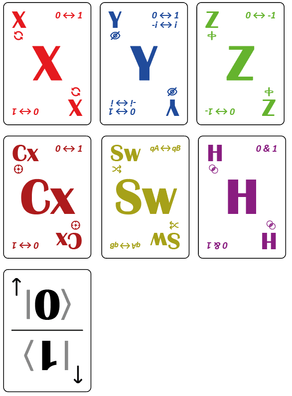

# QuantumPoker
*Una mezcla entre Póker clásico y operadores de Pauli para la enseñanza lúdica de principios cuánticos.*

# Autor
Luis J Camargo 

[Repositorio independiente de QuantumPoker](https://github.com/ljcamargo/quantumpoker)

## Objetivo del juego
Como en el póker, el objetivo es formar la mejor mano posible (el conteo más alto) y ganar el mayor número de fichas del bote. En QuantumPoker, esto se logra manipulando el estado de tus **cartas qubit** mediante **cartas Pauli**, influenciando sus valores (0 o 1) y su visibilidad, para obtener la mayor suma de qubits en estado 1 al final de la ronda de medición.

## Componentes del juego
- **20 cartas Qubit**: Cada carta tiene dos mitades, una con un **0** y otra con un **1**. Su valor depende de cuál mitad está hacia arriba.
- **48 cartas Pauli**: 8 copias de cada una de las 6 operaciones cuánticas: X, Y, Z, H, CX, SWAP.
- **Fichas de apuesta**
- **Moneda**: para colapsar estados en superposición
- **Mazo de cartas comunitarias Pauli**: al igual que el Poker se disponen 5 cartas, aunque pueden ser una por jugador o hasta el límite máximo de 8 o 10.

## Preparación del juego
1. **Preparar el mazo Qubit**:  
   Todas las cartas Qubit son idénticas. Para romper patrones:
   - Divide el mazo en dos mitades.
   - Rota una mitad 180°.
   - Reúnelas y baraja.

2. **Reparto inicial**:  
   Cada jugador recibe **4 cartas Qubit boca abajo**.  
   *Importante:* Las cartas no se deben rotar. Su valor está determinado por su orientación.  
   Como en el póker, los jugadores deben vigilar que nadie altere su mano fuera de turno.

3. **Preparar el mazo Pauli**:  
   Baraja las cartas Pauli de forma normal. Este mazo se usará para revelar cartas comunitarias.

## Desarrollo del juego
El juego se estructura en rondas, como en el póker. En cada ronda:

### 1. Apuestas
- Cada jugador coloca en la mesa **una ficha** para cada qubit, en orden
- Solo la carta **Z** modifica el valor de la apuesta.

### 2. Cartas comunitarias
- Se revelan **cartas Pauli comunitarias**, 5 en la variante clásica, pero puede variar según se decida.
- En orden de turno, cada jugador **toma una carta Pauli** de la mesa y **la aplica a uno de sus qubits** al que desee de sus 4 cartas qubits (según las reglas descritas más abajo).
- Cada carta comunitaria **solo puede usarse una vez** y no puede dejarse sin aplicar. (Aunque hay casos donde no tienen efecto)

### 3. Turnos

El turno pasa de jugador en jugador en sentido horario. En su turno, un jugador:
- Escoge **una** de las cartas comunitarias reveladas disponibles (aún no reclamadas).
- Aplica su efecto sobre **uno de sus qubits** siguiendo las siguientes reglas:

### Reglas de aplicación de cartas Pauli

| Carta | Efecto sobre el Qubit elegido |
|-------|-------------------------------|
| **X** | Invierte el valor: si era 0, pasa a 1; si era 1, pasa a 0. No altera visibilidad ni apuesta. |
| **Y** | Igual que X, pero además obliga a **mostrar la carta** (rotarla hacia los demás) (+i). Si ya estaba mostrada, la vuelve a ocultar (-i). La apuesta **no cambia**. |
| **Z** | No cambia el valor ni visibilidad, pero **duplica** la apuesta sobre ese qubit (+fase). Si ya estaba duplicada, la divide a la mitad.n(-fase) |
| **H¿** | Pone el qubit en **superposición (0+1)** (Hadamard). Para ello, se baja la carta a la mesa, boca abajo si estaba oculta, boca arriba si estaba mostrada. Mientras esté en superposición: - Las cartas X no tienen efecto. - Y y Z siguen aplicando sus efectos. Si se aplica otra H sobre un qubit ya en superposición, este **colapsa** en este momento de la siguiente manera: se lanza una moneda; si cae en cara se asigna 1, si ca en cruz se asigna 0. |
| **Cx** | Carta control que aplica un X a cualquier carta qubit de **otro jugador**. No se puede aplicar a uno propio. |
| **Sw** | Swap. Intercambia un qubit propio por uno de otro jugador incluyendo valor, visibilidad y apuesta de los qubits |

## Medición (Showdown)
- En cualquier momento, un jugador puede declarar una **medición**, bajando sus cartas. Esto inicia una **última ronda** para todos.
- Alternativamente, se puede jugar con la **modalidad de medición clásica** como el Poker: la medición ocurre únicamente **al terminar de revelar las 5 cartas comunitarias**, como en Texas Hold’em.

Durante o después de la medición, cualquier jugador puede ser afectado por CX o SWAP.

Las cartas en superposición deben colapsarse (tirada de moneda) antes de contarse.

## Conteo de puntos
Al final, cada jugador revela (si no lo ha hecho) y **colapsa** sus qubits en superposición tirando una moneda.

- Qubit con valor **0** = 0 puntos  
- Qubit con valor **1** = 1 punto, o **2 puntos si tiene apuesta duplicada**  
- Los puntos se suman solo de los qubits con valor 1 (no de las fichas)

El jugador con **más puntos gana el bote**, sumando las fichas de los qubits que tengan 1 de los demás jugadores.

## Notas adicionales
- Aplicar dos veces Y no acumula duplicación de apuesta. Solo alterna entre duplicada y normal.
- En la vida real, aplicar H no borra la información. Aquí sí, por simplicidad de juego.
- Todos los qubits se mantienen con su valor y apuesta hasta la medición, salvo los colapsos inducidos por Hadamard.

## Set Inicial
- **Máximo de jugadores:** 5  
- **Qubits por jugador:** 4 (total 20 cartas Qubit)  
- **Cartas Pauli:** 8 por tipo (X, Y, Z, H, CX, SWAP) → 48 en total  
- **Fichas**: al menos 8 por jugador para representar apuestas

## Diseños
### Tarjetas

Ejemplo de mano entregada a un participante, en este caso los valores son 0,1,1,0

Diseño de las tarjeta Pauli and las tarjetas qbit

## Instrucciones para la auto impresión

El documento [print_sheet.pdf](print_sheet.pdf) se incluye en PDF listo para imprimir, sólo necesitas imprimir 7 veces esta hoja y recortarlas para tener el juego completo.

También puedes impimir al reverso el patrón para que las cartas tengan mejor presentación.