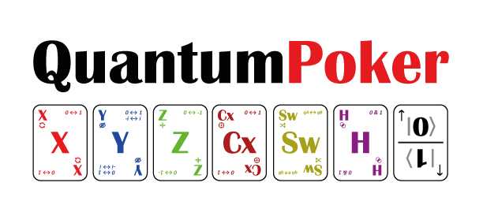
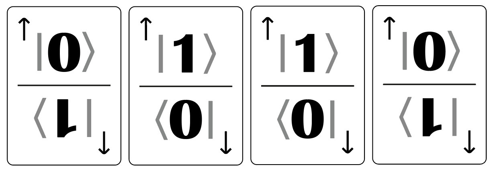
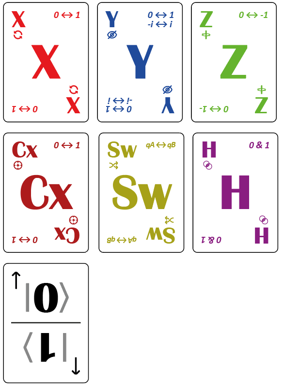

# QuantumPoker
*A mix between classic Poker and Pauli operators for playful teaching of quantum principles.*

# Author
Luis J Camargo

[QuantumPoker standalone repo](https://github.com/ljcamargo/quantumpoker)

## Game Objective
As in poker, the goal is to form the best possible hand (the highest score) and win the most chips from the pot. In QuantumPoker, this is achieved by manipulating the state of your **qubit cards** using **Pauli cards**, influencing their values (0 or 1) and their visibility to obtain the highest number of qubits in state 1 at the end of the measurement round.

## Game Components
- **20 Qubit Cards**: Each card has two halves, one with a **0** and one with a **1**. Its value depends on which half is face-up.
- **48 Pauli Cards**: 8 copies of each of the 6 quantum operations: X, Y, Z, H, CX, SWAP.
- **Betting Chips**
- **Coin**: used to collapse states in superposition
- **Deck of Community Pauli Cards**: Like in Poker, 5 cards are revealed, although it can vary per player or up to a max of 8 or 10.

## Game Setup
1. **Prepare the Qubit Deck**:  
   All Qubit cards are identical. To break patterns:
   - Divide the deck in two halves.
   - Rotate one half 180°.
   - Recombine and shuffle.

2. **Initial Deal**:  
   Each player receives **4 face-down Qubit cards**.  
   *Important:* Cards must not be rotated. Their value is determined by their orientation.  
   As in poker, players must ensure no one tampers with their hand out of turn.

3. **Prepare the Pauli Deck**:  
   Shuffle the Pauli cards normally. This deck will be used to reveal community cards.

## Game Flow
The game proceeds in rounds, like in poker. In each round:

### 1. Betting
- Each player places **one chip** on the table per qubit, in order.
- Only the **Z card** modifies the value of the bet.

### 2. Community Cards
- **Community Pauli cards** are revealed, 5 in the classic variant, but may vary as decided.
- In turn order, each player **takes one Pauli card** from the table and **applies it to one of their qubits**, according to the rules below.
- Each community card **can only be used once** and must be applied. (Though it may sometimes have no effect.)

### 3. Turns
Turn order is clockwise. On their turn, a player:
- Picks **one** of the available, unrevealed community cards.
- Applies its effect to **one of their qubits** following these rules:

### Pauli Card Application Rules

| Card | Effect on Chosen Qubit |
|------|------------------------|
| **X** | Flips the value: 0 becomes 1; 1 becomes 0. Does not affect visibility or bet. |
| **Y** | Same as X, but also forces the card to be **shown** (rotated toward others) (+i). If already shown, it is hidden again (-i). Bet **does not change**. |
| **Z** | Does not change value or visibility but **doubles** the bet on that qubit (+phase). If already doubled, it is halved (-phase). |
| **H** | Puts the qubit in **superposition (0+1)** (Hadamard). The card is placed on the table, face down if hidden, face up if shown. While in superposition: - X cards have no effect. - Y and Z still apply. If another H is applied to a qubit already in superposition, it **collapses** immediately: flip a coin; heads = 1, tails = 0. |
| **CX** | Control-X card that applies an X to any **other player’s** qubit. Cannot be used on your own. |
| **SW** | Swap. Swaps one of your qubits with another player’s, including value, visibility, and bet. |

## Measurement (Showdown)
- At any time, a player may call for a **measurement**, revealing their cards. This begins a **final round** for all players.
- Alternatively, the game may follow a **classic measurement** mode like Poker: the measurement occurs only **after revealing the 5 community cards**, as in Texas Hold’em.

During or after measurement, any player can still be affected by CX or SWAP.

Qubits in superposition must be collapsed (coin toss) before scoring.

## Scoring
At the end, each player reveals (if not already) and **collapses** any qubits in superposition with a coin toss.

- Qubit with value **0** = 0 points  
- Qubit with value **1** = 1 point, or **2 points if bet is doubled**  
- Points are added only from qubits with value 1 (not from the chips themselves)

The player with the **most points wins the pot**, collecting the chips from other players’ qubits that are in state 1.

## Additional Notes
- Applying Y twice does not stack the doubled bet. It only alternates between doubled and normal.
- In real quantum physics, H does not erase information. Here it does, for gameplay simplicity.
- All qubits retain their value and bet until measurement, except for collapses induced by Hadamard.

## Initial Setup
- **Max players:** 5  
- **Qubits per player:** 4 (total of 20 Qubit cards)  
- **Pauli Cards:** 8 of each type (X, Y, Z, H, CX, SWAP) → 48 total  
- **Chips**: at least 8 per player to represent bets

## Designs
### Cards

Sample set of qubit cards delivered to each player, in this case values are 0,1,1,0

Design of all Pauli Cards and Qbit Card

## Self Printing Instructions

A [print_sheet.pdf](print_sheet.pdf) file is included with an A4/Letter ready to print PDF, you just need to print 7 copies of this sheet,cut them out to get the full set of cards of the cards needed.

You may also print the pattern included for the back for a nice look.
